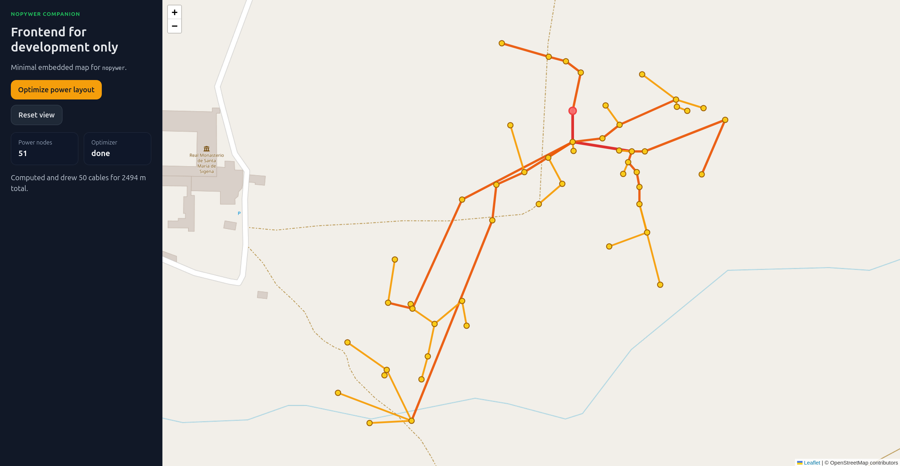

# nopywer /noʊ.paɪ.wɛr/

Pronounced "no-pie-wer" (as in no + python + software)

Visit the homepage of the project: https://vfinel.github.io/nopywer/

Nopywer analyses power grids to compute current flowing through cables, 3-phase balance, and voltage drop. It also includes a cable-layout optimizer (MST + cost-based local search) exposed via a FastAPI server.

## Setup

Requires Python ≥ 3.12 and [uv](https://docs.astral.sh/uv/).

```bash
uv venv
uv sync
```

This installs all runtime and dev dependencies (ruff, pytest, pre-commit…) in a local `.venv`.

### Input data

Nopywer reads a GeoJSON file containing nodes and cables.
A spreadsheet can optionally be provided for equipment inventory.

## Usage

```bash
nopywer-analyze input.geojson
```

See `nopywer-analyze --help` for all options.

### Environment variables

`nopywer-analyze` also reads these environment variables:

- `NOPYWER_INPUT`: input GeoJSON path
- `NOPYWER_OUTPUT`: output GeoJSON path
- `NOPYWER_INVENTORY`: inventory spreadsheet path

Example:

```bash
export NOPYWER_INPUT=input.geojson
export NOPYWER_OUTPUT=output.geojson
export NOPYWER_INVENTORY=inventory.xlsx
nopywer-analyze
```

To start the companion API server:

```bash
nopywer-server
```

Opening [`http://localhost:8042/`](http://localhost:8042/) shows a minimal embedded map.

<p align="center">
  
</p>

## Contributing

Contributions are welcome! See also [CONTRIBUTING.md](docs/CONTRIBUTING.md) for guidelines on reporting bugs, suggesting features, and submitting PRs.

### Lint

The project uses [ruff](https://docs.astral.sh/ruff/) for linting and formatting (line length: 100, see `pyproject.toml` for the full config).

```bash
uv run ruff check .
```

Pre-commit hooks are configured to run ruff automatically on each commit. To install them:

```bash
uv run pre-commit install
```

### Test

Tests use [pytest](https://docs.pytest.org/).

```bash
uv run pytest
```

### CI

A GitHub Actions workflow runs on every pull request and on pushes to `main`/`develop`. It checks:
1. `ruff check .` — lint
2. `pytest` — tests

## Troubleshooting

If you have errors, please reach out (include the complete console output).

## Disclaimer

While efforts have been made to ensure this project's functionality, it is provided "as is" without any warranties.
