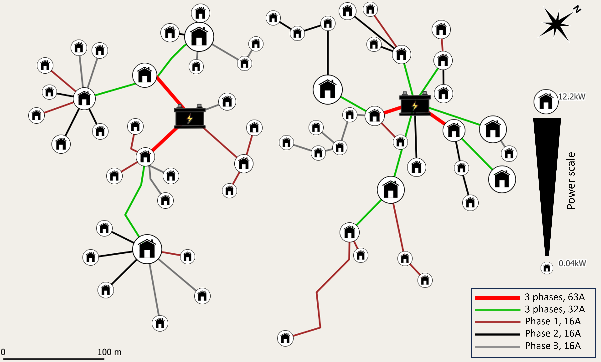

This page is the documentation of [https://github.com/vfinel/nopywer/](https://github.com/vfinel/nopywer/)

[nopywer](https://github.com/vfinel/nopywer/) is a python package that works with [QGIS](https://qgis.org/) to design 3-phases, islanded power grids using automatic grid design features and analysis tools: control current flowing into each branch of the grid, and compute voltage drop at each node. 

Below is an example of a power grids (two, actually), designed using nopywer: 

*Example of a real-case scenario. Houses represents power loads; the size scales with power need. Two 3-phases islanded grids provide power to 61 loads (totalling 195kW) from two generators*

This site will soon be populated with examples and tutorials about how to design power grids yourself, stayed tuned ! 

Oh, and this is an open source projet: contributions are most than welcome ! 