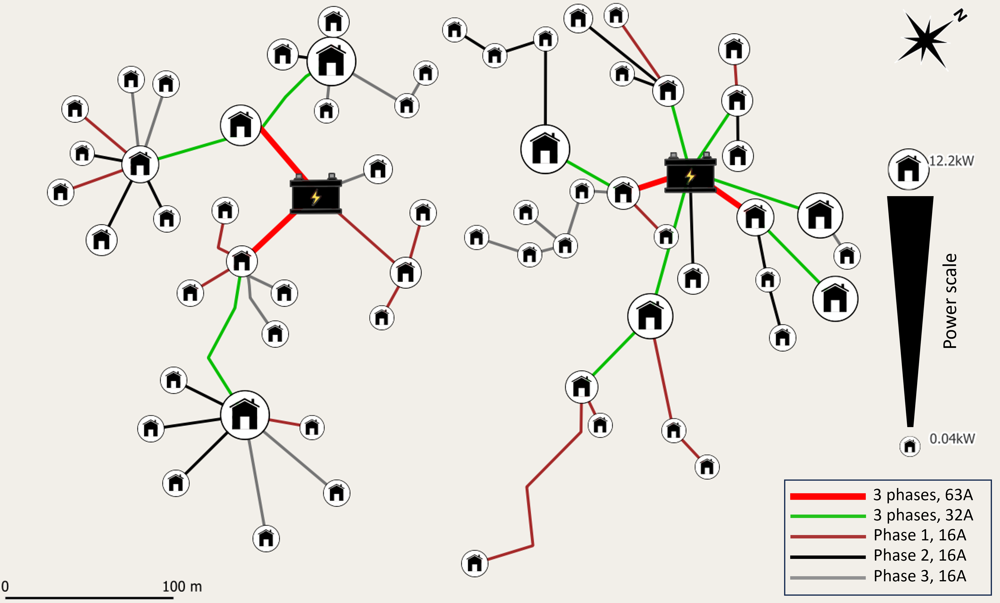

This page is the documentation of [https://github.com/vfinel/nopywer/](https://github.com/vfinel/nopywer/)

[nopywer](https://github.com/vfinel/nopywer/) (pronounced /noʊ.paɪ.wɛr/: "no-pie-wer", as in <u>no</u>+ <u>py</u>thon + po<u>wer</u>) is a python package to design 3-phases, islanded power grids using automatic grid design features and analysis tools. 

Nopywer key features include:
- Design power grids using graph optimization algorithms.
- Analyze current flow and voltage drop to ensure safe grid operation.
- Verify material availability against inventory to plan construction.
- Interact with a map to edit the power grid from your browser - no third-party app necessary
- Open-source code ([GPL-3.0 license](../LICENSE)) : contributions welcome !

Nopywer has been successfully used to design several power grids, as illustred by the following figure.

*Example of a real-case scenario: on this map, houses represent power loads at specific geographic coordinates; their sizes scale with their power needs. In this case, two 3-phases islanded grids were designed to provide power to 61 loads (totalling 195kW) from two generators.*

*Illustration of the map accessible from the browser (this work is currently under active development).*

This site will soon be populated with examples and tutorials about how to design power grids yourself, stayed tuned! 

